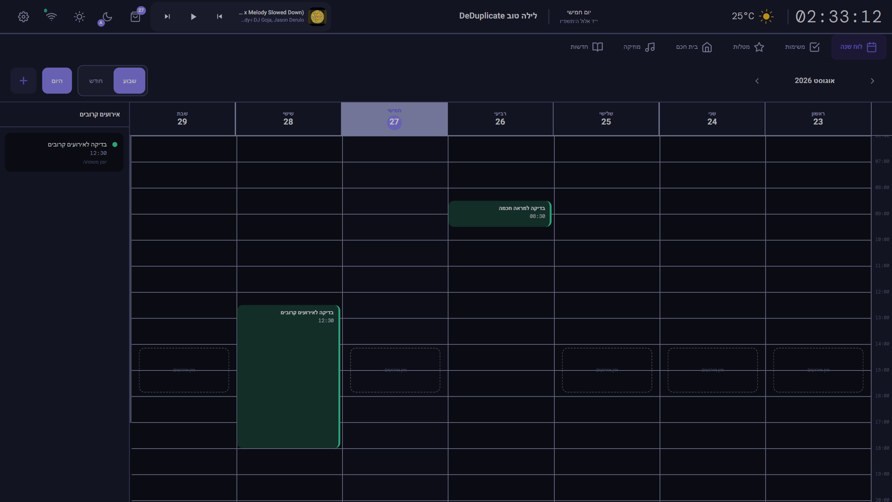
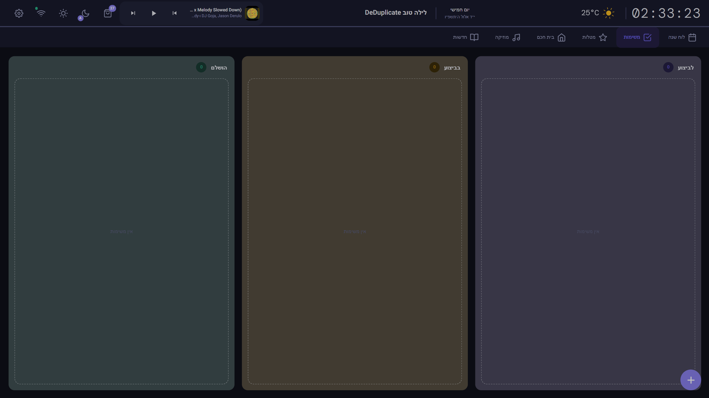
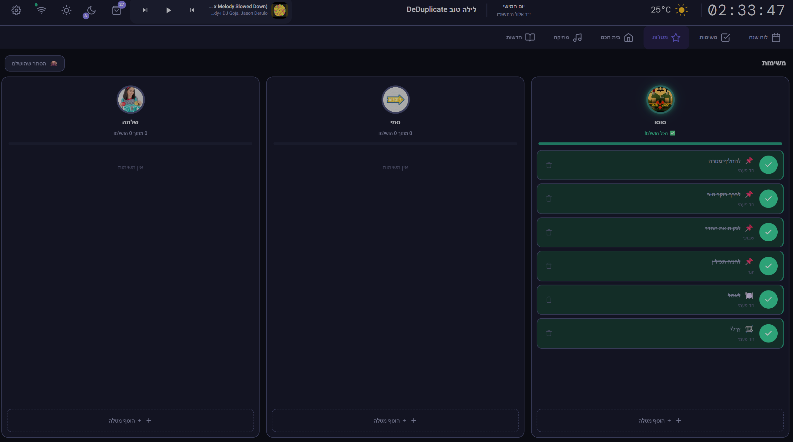
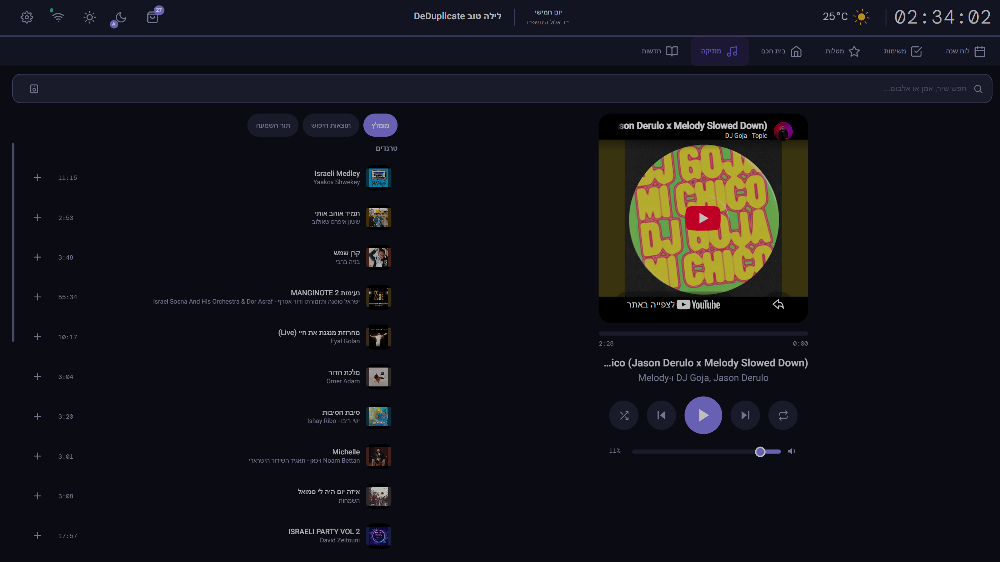
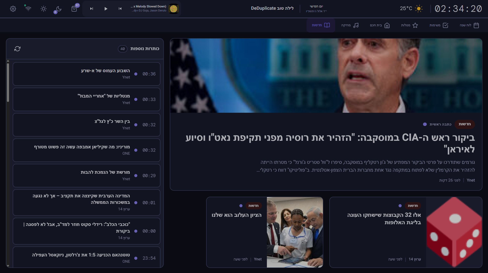

# Smart Mirror Display OS

A beautiful, touch-enabled family dashboard for Raspberry Pi — Hebrew RTL interface with 7 tabs, dark mode, Home Assistant integration, and gamified chores for kids.


---

## Features

### 7 Interactive Tabs

| Tab | Description |
|-----|-------------|
| :calendar: **Calendar** | Weekly grid (Israeli Sun–Thu week) with Google Calendar sync, local event editor, color-coded events, week navigation, month grid, pull-to-refresh |
| :white_check_mark: **Tasks** | Kanban board with drag-and-drop, subtasks, priorities, due dates, Google Tasks sync |
| :star: **Chores** | Per-person columns with progress rings, celebration animations & sounds, family photos |
| :house: **Smart Home** | Home Assistant tiles, AC control (IR scripts), IR remote, curtain/cover control, power monitor, shopping list |
| :musical_note: **Music** | YouTube search + IFrame player with queue, plus MP3 casting to Google Nest / Google Home speakers |
| :newspaper: **News** | Hebrew RSS feeds (Ynet, Channel 14) with full article extraction |
| :gear: **Settings** | Full configuration UI, family management, dark mode, backup/restore, factory reset, setup wizard |

### Music & Casting (YouTube → Google Nest / Home)

- :mag: **YouTube search** and IFrame playback with queue, shuffle, and repeat
- :satellite: **Cast to Google Nest Mini / Home** — since Cast-audio speakers can't render YouTube, the backend transcodes the stream to MP3 on the fly (`yt-dlp` → `ffmpeg`) and serves a self-hosted, HMAC-signed LAN URL the speaker can play
- :bar_chart: **Live progress bar** while casting, synced from Home Assistant media state (play/pause/seek supported)
- :fast_forward: **Auto-advance** through the queue when a track finishes on the speaker
- :rocket: **Next-song pre-warm** — the upcoming track is pre-converted and cached (disk LRU) so playback starts instantly

### System & Data Management

- :floppy_disk: **Backup** the database — creates a server-side snapshot and downloads the `.db` file to your browser
- :inbox_tray: **Restore** from an uploaded `.db` backup (validated SQLite; API token preserved; a safety backup is taken first)
- :arrows_counterclockwise: **Factory reset** — wipe and re-initialize the database (safety backup + token preserved)
- :satellite_antenna: **OTA update** via `git pull` + rebuild, restart app / Raspberry Pi, log viewer, health monitoring
- :sun_behind_small_cloud: **Display schedule** (wake/sleep times), idle detection → screensaver, brightness control
- :signal_strength: **Wi-Fi manager** (scan/connect/forget via `nmcli`)

### Smart Features

- :crescent_moon: **Dark mode** toggle with system-wide theme, plus optional **auto day/night theme**
- :clock1: **Hebrew date** (gematria) + Jewish holidays + Shabbat times (Hebcal)
- :sun_behind_small_cloud: **Animated weather icons** (Open-Meteo + IMS via Home Assistant)
- :speech_balloon: **Daily phrase / quote** of the day
- :family_man_woman_girl_boy: **Family member photos** on chore avatars
- :fireworks: **Fireworks celebration** when kids complete all chores
- :clap: **Clap animation + sound** on each chore completion
- :shopping_cart: **Shopping list** from Home Assistant
- :bust_in_silhouette: **Person presence** indicators (home/away)
- :zap: **Real-time electricity** monitoring
- :electric_plug: **IR remote control** for TVs per room
- :snowflake: **AC control** via IR scripts
- :keyboard: **On-screen keyboard** (Hebrew / English / emoji) for touch input
- :framed_picture: **Screensaver** (clock / photo slideshow) on idle
- :arrow_down: **Pull-to-refresh** on Calendar, Tasks and News
- :iphone: **PWA installable** on mobile
- :desktop_computer: **Multi-resolution scaling** (auto-adapts to any screen)
- :rocket: **First-run setup wizard** (name, location, Google, Home Assistant, music, news)

---

## Tech Stack

| Layer | Technology |
|-------|------------|
| Frontend | React 18 + Vite + Tailwind CSS v3 |
| State | Zustand |
| Real-time | Socket.io |
| Backend | Node.js + Express |
| Database | SQLite (WAL mode) |
| Process | PM2 |
| Kiosk | Chromium (Raspberry Pi) |

---

## Quick Start

### Prerequisites

- **Node.js** 20+
- **npm**
- **ffmpeg** and **yt-dlp** — required for casting YouTube audio to Google Nest / Home speakers (auto-installed by `scripts/setup.sh` on Raspberry Pi)

### Development

```bash
# Clone the repository
git clone https://github.com/DeDuplicate/smart_mirror.git
cd smart_mirror

# Install root dependencies
npm install

# Install frontend dependencies
cd frontend && npm install && cd ..

# Install backend dependencies & configure
cd backend && npm install && cp .env.example .env && cd ..

# Start development servers (frontend + backend)
npm run dev
```

Open **http://localhost:3000** in your browser.

### Raspberry Pi Deployment

```bash
./scripts/setup.sh
```

This script installs all dependencies, builds the frontend, configures PM2, and sets up Chromium kiosk mode.

### Build a Flashable OS Image (Kiosk Appliance)

Turn the whole thing into a dedicated OS: a flashable Raspberry Pi image that boots straight into the Smart Mirror — no desktop, no manual setup.

```bash
cd image
./build.sh      # requires Linux/WSL2 + Docker; outputs deploy/<date>-smart-mirror.img.xz
```

Flash with Raspberry Pi Imager and power on. See **[image/README.md](image/README.md)** for full details (first boot, credentials, service management).

---

## Configuration

Copy `backend/.env.example` to `backend/.env` and fill in your values:

| Variable | Purpose |
|----------|---------|
| `GOOGLE_CLIENT_ID` | Google OAuth client ID (Calendar & Tasks) |
| `GOOGLE_CLIENT_SECRET` | Google OAuth client secret |
| `SPOTIFY_CLIENT_ID` | Spotify app client ID (Music tab) |
| `SPOTIFY_CLIENT_SECRET` | Spotify app client secret |
| `HA_HOST` | Home Assistant URL (e.g. `http://homeassistant.local:8123`) |
| `HA_TOKEN` | Home Assistant long-lived access token |
| `YTDLP_PATH` | Path to the `yt-dlp` binary (optional; auto-detected on `PATH`) |
| `FFMPEG_PATH` | Path to the `ffmpeg` binary (optional; auto-detected on `PATH`) |
| `STREAM_HOST` | LAN host/IP the speaker uses to reach the MP3 stream (optional; auto-detected, set manually for Docker) |

---

## Project Structure

```
smart_mirror/
├── frontend/
│   ├── public/              # Static assets, PWA manifest, sounds
│   └── src/
│       ├── components/
│       │   ├── pages/       # CalendarPage, TasksPage, ChoresPage, HomePage,
│       │   │                # MusicPage, NewsPage, SettingsPage
│       │   ├── TopBar.jsx   # Clock, weather, Hebrew date, dark mode
│       │   ├── TabBar.jsx   # Bottom navigation tabs
│       │   └── ...          # Shared UI (modals, overlays, animations)
│       ├── hooks/           # useCalendar, useChores, useMusic, useHomeAssistant, ...
│       ├── store/           # Zustand global store
│       ├── i18n/            # Hebrew translations
│       └── styles/          # Design system (CSS custom properties)
├── backend/
│   ├── routes/              # Express API routes
│   ├── .env.example         # Environment variable template
│   └── ...
├── scripts/
│   ├── setup.sh             # Raspberry Pi setup script
│   ├── start-kiosk.sh       # Chromium kiosk launcher
│   └── backup.sh            # Database backup utility
├── ecosystem.config.js      # PM2 process configuration
└── package.json
```

---

## Screenshots

### :calendar: Calendar — weekly grid with Google Calendar sync


### :white_check_mark: Tasks — kanban board with drag-and-drop


### :star: Chores — per-person columns with progress & celebrations


### :musical_note: Music — YouTube search, queue & player


### :newspaper: News — Hebrew RSS headlines with article view


---

## License

MIT
