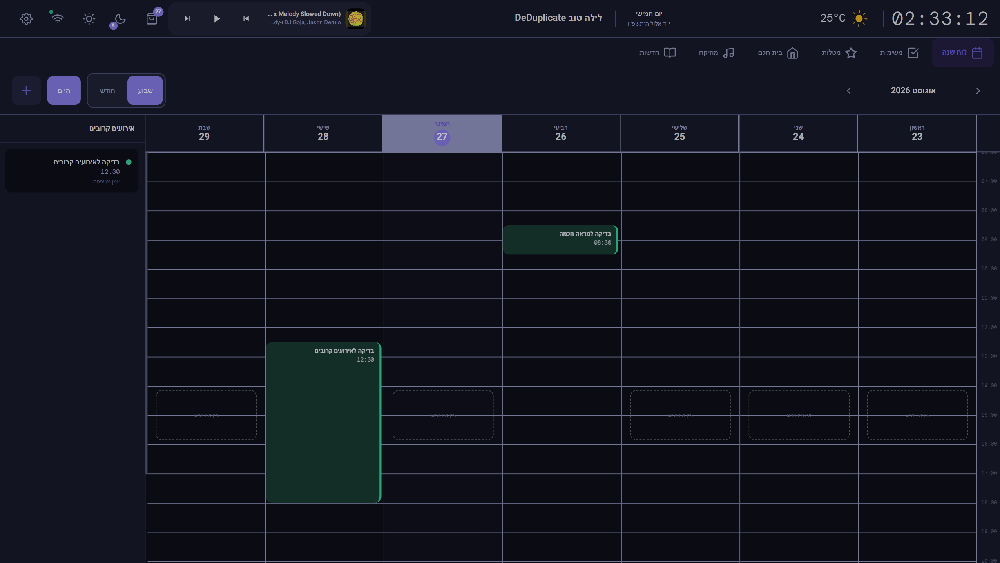
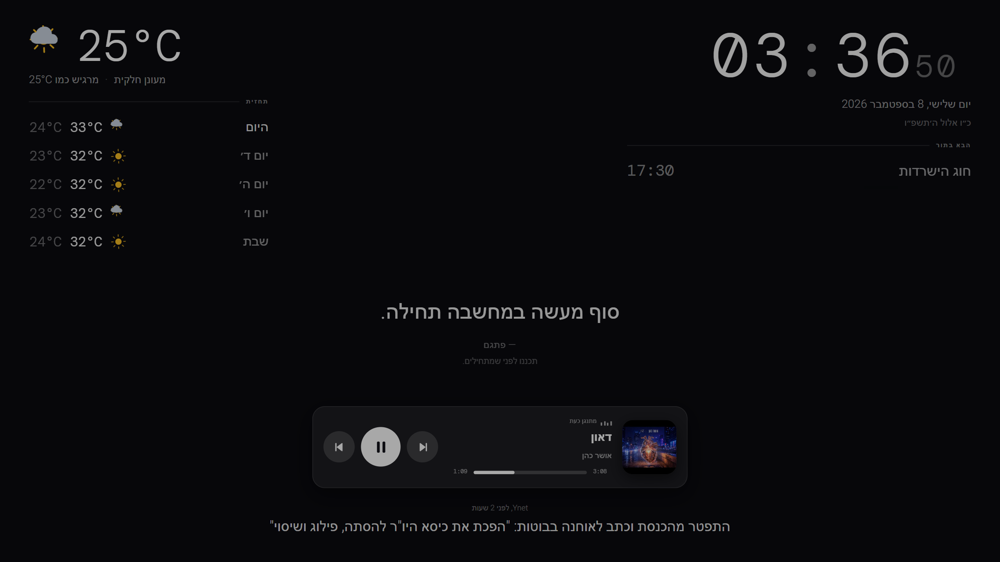
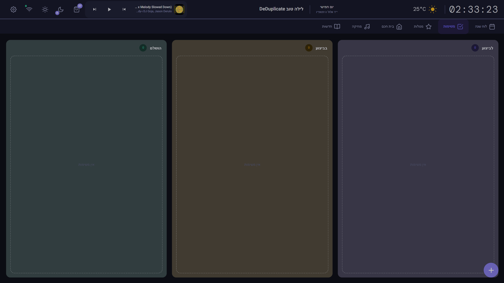
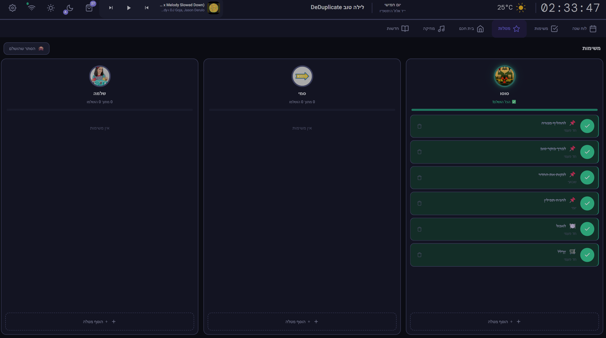
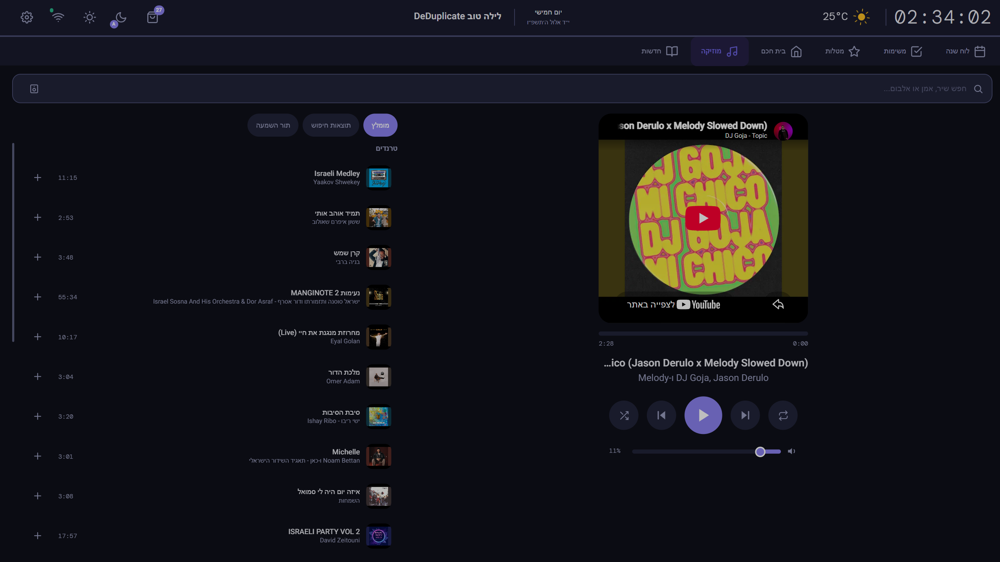

# Smart Mirror Display OS

A beautiful, touch-enabled family dashboard for Raspberry Pi (or any small PC) — Hebrew RTL interface with 8 tabs plus an optional security-cameras tab, landscape **and portrait** layouts, dark mode, Home Assistant integration, and gamified chores for kids.


---

## Features

### Interactive Tabs

| Tab | Description |
|-----|-------------|
| :calendar: **Calendar** | Day / week / month views (Israeli Sun–Thu week) with Google Calendar ICS sync, local event editor, color-coded events, upcoming-events sidebar with explicit day labels, pull-to-refresh |
| :white_check_mark: **Tasks** | Kanban board with drag-and-drop, subtasks, priorities, due dates |
| :star: **Chores** | Per-person columns with progress rings, celebration animations & sounds, family photos |
| :books: **School** | Weekly timetable per child plus a "what to bring today" checklist — tick off each subject once it's packed |
| :house: **Smart Home** | Rooms with live temperature/humidity and their remotes, AC control (IR scripts), curated devices (lights, curtain, boiler), live power meter |
| :musical_note: **Music** | YouTube search + IFrame player with queue, plus MP3 casting to Google Nest / Google Home speakers |
| :alarm_clock: **Alarms** | Multi-room alarm clock with Android-style clock dial, recurring days, YouTube track/playlist alarms, volume escalation, and Google Cast speaker targeting |
| :newspaper: **News** | Hebrew RSS feeds (Ynet, Channel 14) with full article extraction |
| :video_camera: **Cameras** | DVR / NVR / IP-camera grid with fullscreen viewer and motion & face alerts — the tab only appears once a camera is configured (see [Security Cameras](#video_camera-security-cameras)) |

> **Note:** **Settings** (:gear:) is always accessible directly from the TopBar header (family management, dark mode, display schedule, backups, OTA updates, and setup wizard).

### :framed_picture: Ambient Screensaver

Inspired by [MagicMirror²](https://github.com/MagicMirrorOrg/MagicMirror)'s region layout, the
screensaver turns the idle display into a glanceable information board rather than a blank screen.
The clock, photo-slideshow and **security-cameras** styles share one region grid, so every element keeps its position.
In the cameras style the camera grid replaces the photos, and a camera that reports motion is spotlighted for 30 seconds.

- :clock3: **Clock & date** — live time, Gregorian date, and the Hebrew date with gematria year
- :calendar: **Agenda** — the next events and today's tasks as time-marked rows, with the imminent
  item switching to a live countdown so a close appointment can't be missed
- :sun_behind_small_cloud: **Weather** — large current temperature plus a 5-day forecast with
  daily high/low
- :newspaper: **News ticker** — rotating headline with source and relative-time byline
- :musical_note: **Now playing** — album art, track info, and transport controls while music
  plays; auto-hides 30 seconds after playback stops
- :speech_balloon: **Daily phrase** — with attribution and a short explanation

### :framed_picture: Photo Frame (Google Photos Frame–style)

The screensaver's photo-slideshow style turns the idle display into a digital photo frame — like a Google Photos smart frame — with three interchangeable photo sources, configured in **Settings → תצוגה**:

- **Local folder** — drop images into `backend/data/photos/` (subfolders up to 3 levels deep supported). No restart needed; see [`backend/data/photos/README.md`](backend/data/photos/README.md).
- **NAS share (CIFS/SMB)** — mount a Synology/TrueNAS/Windows share read-only so family members drop photos on the NAS and they show up automatically. Set up with `scripts/mount-photos-share.sh`; full guide in [`scripts/README-photo-share.md`](scripts/README-photo-share.md).
- **Immich server** — point the mirror at an existing [Immich](https://immich.app) instance (URL + API key) and pick a random deck, a specific album, or filter by recognized person/favorites; images are proxied through the backend so the API key never reaches the browser.

Only one source is active at a time — pick the one that fits your setup. If the source is empty or unreachable, the slideshow falls back to the built-in gradients instead of breaking.

**Transitions.** Pick how one photo gives way to the next in **Settings → תצוגה → מעבר בין תמונות**: fade, slide, zoom, a quick 0.2 s dissolve, or random (a different one each time). They move only opacity and transform, so they stay smooth on the Pi's software rendering. The next photo is fetched and decoded before the swap and the old one stays on screen underneath, so the frame never goes blank between pictures. Moving the interval slider shows a message saying what was saved.

### :speech_balloon: Daily Phrase

- **133 curated Hebrew phrases**, each with a source and a one-line explanation
- **Day-seeded shuffle** — a deterministic per-day ordering, so every client agrees on the current
  phrase without server state, and the order differs each day instead of repeating on a fixed cycle
- **Configurable rotation interval** (1 minute → once a day) in Settings → Display

### :musical_note: Music & Audio Casting

- :mag: **YouTube search** and IFrame playback with queue, shuffle, and repeat
- :satellite: **Cast to Google Nest Mini / Home** — since Cast-audio speakers can't render YouTube, the backend transcodes the stream to MP3 on the fly (`yt-dlp` → `ffmpeg`) and serves a self-hosted, HMAC-signed LAN URL the speaker can play
- :bar_chart: **Live progress bar** while casting, synced from Home Assistant media state (play/pause/seek supported)
- :fast_forward: **Auto-advance** through the queue when a track finishes on the speaker
- :rocket: **Next-song pre-warm** — the upcoming track is pre-converted and cached (disk LRU) so playback starts instantly
- :headphones: **Bluetooth speakers & headphones** — pair them in **Settings → Bluetooth**; saved devices then appear in the music output picker and as alarm targets (an alarm can ring on several at once). The mirror keeps playing locally and its audio is routed to the speaker, which reconnects a sleeping speaker on demand and falls back to HDMI if it drops. Needs a Bluetooth adapter and a sound server (PulseAudio): flashable images and `scripts/setup.sh` include it (installed with `--no-install-recommends`, analog jack hidden so HDMI stays the default output); on an older install, Settings offers a one-tap **Install audio support** and the kiosk restarts once so Chromium picks it up.
- :loud_sound: **Sonos speakers** — controlled directly over the LAN (UPnP via [`@svrooij/sonos`](https://github.com/svrooij/node-sonos-ts)), no Home Assistant needed. **Settings → Sonos** searches for them (SSDP), or takes one speaker's IP when WiFi drops multicast; each room then shows up in the music output picker and as an alarm target like any other speaker, with live play/pause state, progress and volume. Commands to a speaker that is grouped under another are routed to the group's coordinator. Rooms play the same self-hosted stream as Nest speakers.

### :desktop_computer: Display & Orientation

All in **Settings → Display**:

- **Orientation** — landscape, or portrait for a vertically mounted panel (two portrait directions, depending on which way the frame is turned). On the Pi this rotates the screen *and* remaps the touch frame (`xrandr` + `xinput`), then relaunches Chromium at the new size. Every tab, the screensaver, the setup wizard and the popups have a dedicated portrait layout (a `pt:` Tailwind variant), not a squeezed landscape one.
- **Resolution** — pick any mode the connected screen reports (read from `xrandr`), or leave it on automatic.
- **Interface size** — 50–150% zoom, applied live. Use it to make everything larger on a 4K panel, or to fit more on a small one.
- The canvas scales uniformly and fills any aspect ratio (16:9, 16:10, ultrawide, 4:3) instead of stretching.

### :video_camera: Security Cameras

Connect DVRs, NVRs and IP cameras in **Settings → Cameras**. The Cameras tab appears automatically once at least one camera is enabled.

- **Supported sources** — Hikvision (DVR/NVR/camera), Dahua / Amcrest / Lorex, XMEye cheap DVRs (`dvrip`), ONVIF (with LAN discovery), Frigate restreams, any RTSP URL, or a plain JPEG snapshot URL. DVR/NVR presets only need the address, credentials and channel number.
- **Test button** shows a snapshot before saving; passwords never leave the backend (the UI only sees that a password is stored).
- **Snapshots vs live video** — by default tiles refresh JPEG snapshots every few seconds, using the camera's own snapshot endpoint where possible (near-zero CPU). Turn on **Live video** on a PC and every view — the tab, the screensaver and the alerts — streams real video; a camera that can't be played falls back to snapshots.
- **Motion & face alerts** — a popup (above everything except alarms) with the camera's picture, e.g. "אוריין זוהה/ה ב־כניסה"; tap it to open that camera fullscreen. Choose which alert types to show.
  - **Motion** — map each camera to a Home Assistant motion `binary_sensor` (the camera/DVR does the detecting, so this works on a Pi).
  - **People, objects & faces** — point the app at a [Frigate](https://frigate.video) server (face recognition since Frigate 0.16). Frigate needs an amd64/arm64 machine such as an Intel N100 mini PC — it cannot run on a Pi 2.
- **Raspberry Pi notes** — a Pi 2 cannot decode video smoothly in Chromium, so keep Live video off there. Chromium never plays H.265 on a Pi: set the cameras' sub-streams to **H.264**.

### System & Data Management

- :floppy_disk: **Backup** the database — creates a server-side snapshot and downloads the `.db` file to your browser
- :inbox_tray: **Restore** from an uploaded `.db` backup (validated SQLite; API token preserved; a safety backup is taken first)
- :arrows_counterclockwise: **Factory reset** — wipe and re-initialize the database (safety backup + token preserved)
- :satellite_antenna: **OTA update** from the Settings screen (fetch + reset to `origin/main`, so a rewritten/force-pushed history can't wedge the updater), restart app / Raspberry Pi, log viewer, health monitoring
  - :package: `frontend/dist` is committed — the Pi only builds when it is missing, because a Vite build exhausts a Pi 2's GPU memory
  - :arrow_left: **Automatic rollback** — if the dependency install or the frontend build fails, the previous commit is restored and reinstalled, so a bad update can't brick a keyboard-less wall display
  - :chart_with_upwards_trend: **Live progress** streamed over Socket.io (pull → install → build → restart), not a blind spinner
  - :alarm_clock: **Nightly update check** (04:30) that only *notifies* — installs stay manual and deliberate
  - :shield: Refuses to update on a dirty working tree, and verifies the restart actually happened by polling the running commit
- :sun_behind_small_cloud: **Display schedule** (wake/sleep times), idle detection → screensaver, brightness control
- :signal_strength: **Wi-Fi manager** (scan/connect/forget via `nmcli`)

### Smart Features

- :crescent_moon: **Dark mode** toggle with system-wide theme, plus optional **auto day/night theme**
- :clock1: **Hebrew date** (gematria) + Jewish holidays + Shabbat times (Hebcal)
- :sun_behind_small_cloud: **Animated weather icons** (Open-Meteo + direct IMS)
- :speech_balloon: **Daily phrase / quote** of the day — 133 phrases with sources and explanations, configurable rotation
- :family_man_woman_girl_boy: **Family member photos** on chore avatars
- :fireworks: **Fireworks celebration** when kids complete all chores
- :arrow_up_down: **Drag to reorder chores** — grab the grip on a chore and drag it up or down to order each kid's list; open and done chores stay in their own groups and the order is saved
- :crescent_moon: **Nightly chore reset** (opt-in, Settings → family members) — at 00:00 every ticked chore is unticked so each day starts clean; open screens update immediately
- :clap: **Clap animation + sound** on each chore completion
- :shopping_cart: **Shopping list** from Home Assistant
- :bust_in_silhouette: **Person presence** indicators (home/away)
- :zap: **Real-time electricity** monitoring
- :snowflake: **Air-conditioner control per room** — the popup offers exactly the presets Home Assistant has (`GET /api/ha/ac-presets` reads the learned-command scripts such as "Power On Cold 24 Low", per Broadlink blaster) instead of guessing script names; adding a script adds an option. IR is one-way, so the popup shows what was *last sent*, never a guessed state.
- :electric_plug: **IR remote control** for TVs per room. Rooms are discovered from `remote.wifi_ir_<room>` blasters (a new blaster appears on its own, with its `sensor.wifi_ir_<room>_temperature/humidity`). The living-room TV is driven by its HA scripts (`script.tv`, `script.ok`, …), and a key whose script targets a blaster that no longer exists is dimmed and says so instead of silently doing nothing
- :snowflake: **AC control** via IR scripts
- :keyboard: **On-screen keyboard** (Hebrew / English / emoji) for touch input
- :alarm_clock: **Alarm clock** with Android clock dial, repeating days, YouTube media, volume escalation & speaker targets
- :bell: **Event reminders** with chime audio alerts, persistent queue & snooze for calendar events
- :framed_picture: **Screensaver** (clock / photo slideshow / security cameras) on idle — see [Ambient Screensaver](#framed_picture-ambient-screensaver)
- :framed_picture: **Photo frame** like a Google Photos frame — local folder, NAS (CIFS/SMB), or Immich server — see [Photo Frame](#framed_picture-photo-frame-google-photos-framestyle)
- :arrow_down: **Pull-to-refresh** on Calendar, Tasks and News
- :iphone: **PWA installable** on mobile
- :desktop_computer: **Any screen** — landscape or portrait, choose the resolution, and scale the whole UI (50–150%) for 4K panels — see [Display & Orientation](#desktop_computer-display--orientation)
- :video_camera: **Security cameras** with motion / person / face alerts — see [Security Cameras](#video_camera-security-cameras)
- :rocket: **First-run setup wizard** (name, location, Google, Home Assistant, music, news)

---

## Tech Stack

| Layer | Technology |
|-------|------------|
| Frontend | React 18 + Vite + Tailwind CSS v3 |
| State | Zustand |
| Real-time | Socket.io |
| Backend | Node.js + Express |
| Database | SQLite (WAL mode) |
| Process | PM2 |
| Kiosk | Chromium (Raspberry Pi) |
| Cameras | [go2rtc](https://github.com/AlexxIT/go2rtc) sidecar (auto-downloaded); optional [Frigate](https://frigate.video) for detection |

---

## Quick Start

### Prerequisites

- **Node.js** 20+
- **npm**
- **ffmpeg** and **yt-dlp** — required for casting YouTube audio to Google Nest / Home speakers (auto-installed by `scripts/setup.sh` on Raspberry Pi). ffmpeg is also used for camera snapshots from H.264 streams
- **go2rtc** is downloaded automatically (to `backend/bin/`) the first time a camera is added — nothing to install

### Development

```bash
# Clone the repository
git clone https://github.com/DeDuplicate/smart_mirror.git
cd smart_mirror

# Install root dependencies
npm install

# Install frontend dependencies
cd frontend && npm install && cd ..

# Install backend dependencies & configure
cd backend && npm install && cp .env.example .env && cd ..

# Start development servers (frontend + backend)
npm run dev
```

Open **http://localhost:3000** in your browser.

### Raspberry Pi Deployment

```bash
./scripts/setup.sh
```

This script installs all dependencies, builds the frontend, configures PM2, and sets up Chromium kiosk mode.

### Build a Flashable OS Image (Kiosk Appliance)

Turn the whole thing into a dedicated OS: a flashable Raspberry Pi image that boots straight into the Smart Mirror — no desktop, no manual setup.

```bash
cd image
./build.sh      # requires Linux/WSL2 + Docker; outputs deploy/<date>-smart-mirror.img.xz
```

Flash with Raspberry Pi Imager and power on. See **[image/README.md](image/README.md)** for full details (first boot, credentials, service management).

---

## Configuration

Copy `backend/.env.example` to `backend/.env` and fill in your values:

| Variable | Purpose |
|----------|---------|
| `PORT` | Backend server port (default: `3001`) |
| `NODE_ENV` | Environment mode (`production` or `development`) |
| `SPOTIFY_CLIENT_ID` | Spotify app client ID (optional, for Spotify integration) |
| `SPOTIFY_CLIENT_SECRET` | Spotify app client secret |
| `HA_HOST` | Home Assistant URL (e.g. `http://homeassistant.local:8123`) |
| `HA_TOKEN` | Home Assistant long-lived access token |
| `TOKEN_SECRET` | Secret key used to encrypt OAuth tokens at rest (auto-generated if unset) |
| `YTDLP_PATH` | Path to the `yt-dlp` binary (optional; auto-detected on `PATH`) |
| `FFMPEG_PATH` | Path to the `ffmpeg` binary (optional; auto-detected on `PATH`) |
| `STREAM_HOST` | LAN host/IP the speaker uses to reach the MP3 stream (optional; auto-detected, set manually for Docker) |
| `GO2RTC_URL` | Use an existing go2rtc (e.g. Frigate's, `http://frigate.local:1984`) instead of the bundled one (optional) |

---

## School schedule API

Family dropdowns reuse `GET /api/tasks/people` (an array containing `id`, `name`,
`color`, `avatar`, and `tasks`). School data references those same people.
Migration `010_school_schedule.sql` is discovered and applied automatically at startup.

| Endpoint | Request | Response |
| --- | --- | --- |
| `GET /api/school/schedule` | — | `{ schedule: { [personId]: { [dayOfWeek]: string[] } } }` |
| `PUT /api/school/schedule/:personId/:dayOfWeek` | `{ subjects: string[] }` | `{ ok: true }` |
| `GET /api/school/items` | — | `{ items: { [subject]: string[] } }` |
| `PUT /api/school/items/:subject` | `{ items: string[] }` | `{ ok: true }` |
| `GET /api/school/today?date=YYYY-MM-DD` | Optional local date | `{ date, people: [{ personId, name, color, subjects: [{ subject, items: [{ itemKey, label, checked }] }] }] }` |
| `POST /api/school/checklist/toggle` | `{ personId, date, itemKey, checked: boolean }` | `{ ok: true }` |

Days run Sunday (`0`) through Saturday (`6`). Schedule responses include every
person but omit empty days; today's response includes people with no subjects.
Lists retain their supplied order and exact text; blank/non-string entries are
rejected. Empty lists clear a day or subject mapping. URL-encode subject path
parameters once. Dates must be real `YYYY-MM-DD` dates; omitted dates default to
the server's local today. Item keys are exactly `<subject>::<item>`, and checks
are independent per person and date. Invalid input returns `400`, unknown
people return `404`, and errors use `{ error: string }`.

Schedule/equipment writes emit `school:updated` without a payload. Checklist
writes emit `school:checklist-updated` with `{ personId, date, itemKey, checked }`.
Deleting a family member cascades to their school schedule and checked rows.
Run the isolated migration/HTTP regression check with
`node --test backend/test-school.js`.

## Cameras API

Camera config lives in its own table (migration `011_cameras.sql`). go2rtc runs as a backend child process bound to `127.0.0.1:1984`, only while a camera is enabled, and every request goes through the authenticated Express API.

| Endpoint | Purpose |
| --- | --- |
| `GET /api/cameras` | `{ cameras: [...], engine: { running, external, error } }` — passwords masked (`passwordSet`, `***` in URLs) |
| `POST /api/cameras`, `PUT /api/cameras/:id`, `DELETE /api/cameras/:id` | CRUD (an empty password on update keeps the stored one) |
| `PUT /api/cameras/order` | `{ ids: [...] }` reorder |
| `GET /api/cameras/:id/snapshot.jpg?quality=sub` | JPEG snapshot (native camera snapshot first, decoded frame as fallback) |
| `GET /api/cameras/:id/stream.mp4?quality=main` | Live fMP4 for a plain `<video>` tag (H.264) |
| `POST /api/cameras/test` | Try a camera config — returns a JPEG or `{ error }` |
| `GET /api/cameras/discover` | ONVIF LAN discovery |
| `GET /api/cameras/events/recent` | Last 20 motion / object / face events |

Socket events: `cameras:updated` (config changed) and `camera:event` (`{ cameraId, cameraName, type: 'motion' | 'object' | 'face', label, subLabel, snapshotUrl, ts }`). Run the check with `node backend/test-cameras.js`.

## Project Structure

```
smart_mirror/
├── frontend/
│   ├── public/              # Static assets, PWA manifest, sounds
│   └── src/
│       ├── components/
│       │   ├── pages/       # CalendarPage, TasksPage, ChoresPage, SchoolPage, HomePage,
│       │   │                # MusicPage, AlarmsPage, NewsPage, CamerasPage, SettingsPage
│       │   ├── TopBar.jsx   # Clock, weather, Hebrew date, dark mode, settings
│       │   ├── TabBar.jsx   # Tab navigation (hides the Cameras tab until one is set up)
│       │   ├── CameraTile.jsx, CameraEventOverlay.jsx  # Camera views + motion/face popup
│       │   └── ...          # Shared UI (modals, AlarmOverlay, ReminderOverlay, popups)
│       ├── hooks/           # useCalendar, useChores, useMusic, useHomeAssistant, ...
│       ├── store/           # Zustand global store
│       ├── i18n/            # Hebrew translations
│       └── styles/          # Design system (CSS custom properties)
├── backend/
│   ├── routes/              # Express API routes (cameras.js + go2rtc.js = camera module)
│   ├── db/migrations/       # Numbered SQL migrations, applied automatically at startup
│   ├── .env.example         # Environment variable template
│   └── ...
├── scripts/
│   ├── setup.sh             # Raspberry Pi setup script
│   ├── sync-to-pi.js        # Auto-sync & deploy to Raspberry Pi
│   ├── start-kiosk.sh       # Chromium kiosk launcher (re-applies rotation/resolution each launch)
│   ├── apply-orientation.sh # xrandr rotation + resolution + touch-matrix remap
│   ├── backup.sh            # Database backup utility
│   ├── set-ha-token.sh      # Home Assistant token configuration script
│   └── generate-icons.js    # PWA icon generator
├── ecosystem.config.js      # PM2 process configuration
└── package.json
```

---

## Screenshots

### :calendar: Calendar — weekly grid with Google Calendar sync


### :framed_picture: Screensaver — ambient info board on idle


### :white_check_mark: Tasks — kanban board with drag-and-drop


### :star: Chores — per-person columns with progress & celebrations


### :musical_note: Music — YouTube search, queue & player


### :newspaper: News — Hebrew RSS headlines with article view


---

## License

MIT
